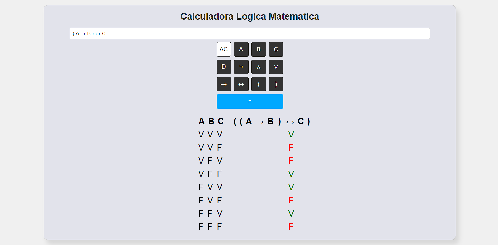

# Calculadora de Lógica Matemática
Desenvolvimento de uma Calculadora de Lógica Matemática, criando tabelas verdade para cada equação por meio de funções e mecânicas básicas em JavaScript, combinadas com conceitos simples de HTML e CSS. 
[Link da Página](https://grupo1bccufabc.github.io/tabelaverdadecalculadora/)

